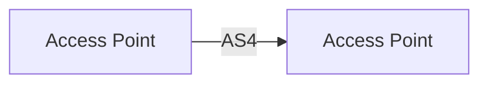

# Contributing to WS3 deliverables

## Workflow

All changes — new sections, revisions, corrections — go through a **Pull Request**.

1. Create a branch from `main` (name it `deliverable/short-description`, e.g. `future-trust/pki-section`)
2. Make your changes
3. Open a PR using the template — describe what changed and why
4. At least one WS3 member must approve before merge
5. The author merges after approval

No direct commits to `main`.

---

## Section status labels

Use Just the Docs callout syntax at the top of any section whose status needs flagging.

```markdown
{: .draft }
> This section is a first draft. Feedback welcome before the next WS3 meeting.
```

```markdown
{: .proposed }
> The position in this section is proposed. Open for comment until YYYY-MM-DD.
```

```markdown
{: .accepted }
> This section reflects the agreed WS3 position as of YYYY-MM-DD.
```

```markdown
{: .open-question }
> **Open question:** [Short statement of what is unresolved.]  
> Tracked in [issue #N](https://github.com/<org>/<repo>/issues/N).
```

Sections without a callout are assumed to be working drafts.

---

## Diagrams

Use **Mermaid** for all architecture and flow diagrams. Mermaid is enabled in 
`_config.yml` and renders natively in GitHub and in the Pages site.

````markdown

````

Export static SVG versions for deliverables that need to be shared outside GitHub.

---

## Front matter conventions

Every page must have at minimum:

```yaml
---
title: "Page title"
parent: "Parent section title"   # omit for top-level pages
nav_order: N
last_modified_date: YYYY-MM-DD
---
```

---

## Decision records (future)

A `docs/decisions/` folder is reserved for formal decision records once the 
working group adopts that process. Do not use it for content yet.
