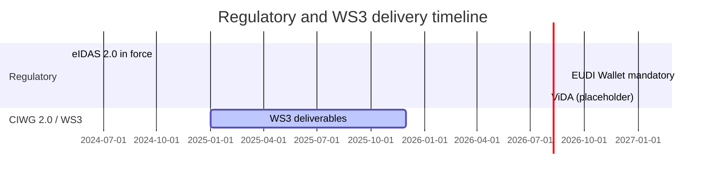

# Drivers and Timeline

{: .draft }
> Draft – placeholder structure.

## Regulatory drivers

| Driver | Regulation | Key obligation | Applicability date | Impact on Peppol |
|---|---|---|---|---|
| eIDAS 2.0 / EUDI Wallet | Regulation (EU) 2024/1183 | | | |
| ViDA | Council Directive (EU) 2025/... | | | |
| EUBW | Regulation (EU) 2025/... | | | |
| NIS2 | Directive (EU) 2022/2555 | | 2024-10-17 | |

## Market and ecosystem drivers

_Non-regulatory forces that create pressure or opportunity for evolution._

## Timeline

