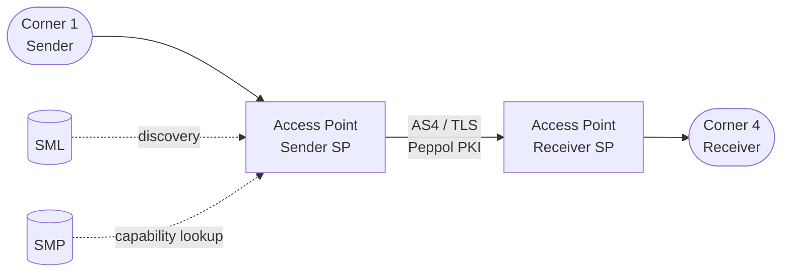

# Current Trust Baseline

{: .draft }
> Draft – intended as a concise summary; detailed analysis lives in WS3 Trends Analysis.

This section establishes the baseline from which the future architecture departs.
It is intentionally brief — its purpose is to anchor the delta, not to 
re-document the current model in full.

## Trust model summary

The current Peppol trust model is built on:

- **PKI**: Peppol-issued certificates for Service Provider identification and 
  message signing/encryption. The Peppol CA is the root of trust.
- **Accreditation**: Service Providers are accredited by Peppol Authorities, 
  who act as the trust anchor for participant onboarding in their jurisdiction.
- **SMP/SML**: Participant discovery via the Service Metadata Publisher / 
  Service Metadata Locator infrastructure.
- **Four-corner model**: Sender AP → Receiver AP with no direct trust 
  relationship required between corners 1 and 4.

## Identified limitations

_These are the structural limitations the future architecture must address._

| Limitation | Impact | Reference |
|---|---|---|
| | | |

## Regulatory pressure points

_Specific regulatory requirements that the current model does not fully satisfy._

| Requirement | Regulation | Gap |
|---|---|---|
| | | |

---

_Figure: Simplified current four-corner trust model_
