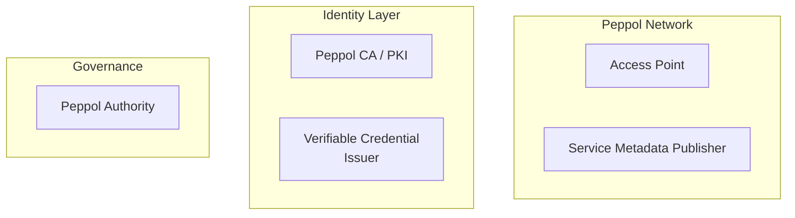

# Target Architecture

{: .draft }
> Draft – placeholder structure. Content to be developed in WS3.

## Architecture overview

_High-level narrative of the target state._

---

## Trust boundaries

_Define the trust domains and the boundaries between them._

| Trust domain | Participants | Trust mechanism |
|---|---|---|
| Peppol network | Service Providers, Peppol Authorities | Peppol PKI + accreditation |
| | | |

---

## Component model

_Describe the principal architectural components and their trust roles._

_Figure: Component model placeholder – to be developed_

---

## Key interfaces

_Enumerate the trust-relevant interfaces and the mechanisms securing them._

| Interface | From | To | Mechanism | Status |
|---|---|---|---|---|
| | | | | |

---

## Design decisions

_Record significant design choices made in arriving at this architecture.
Cross-reference GitHub issues or PR discussions as appropriate._

<!-- 
Note: This section is the natural future home for links to formal Decision Records
once the WS3 decision process is established.
-->

| # | Decision | Rationale | Date |
|---|---|---|---|
| | | | |
