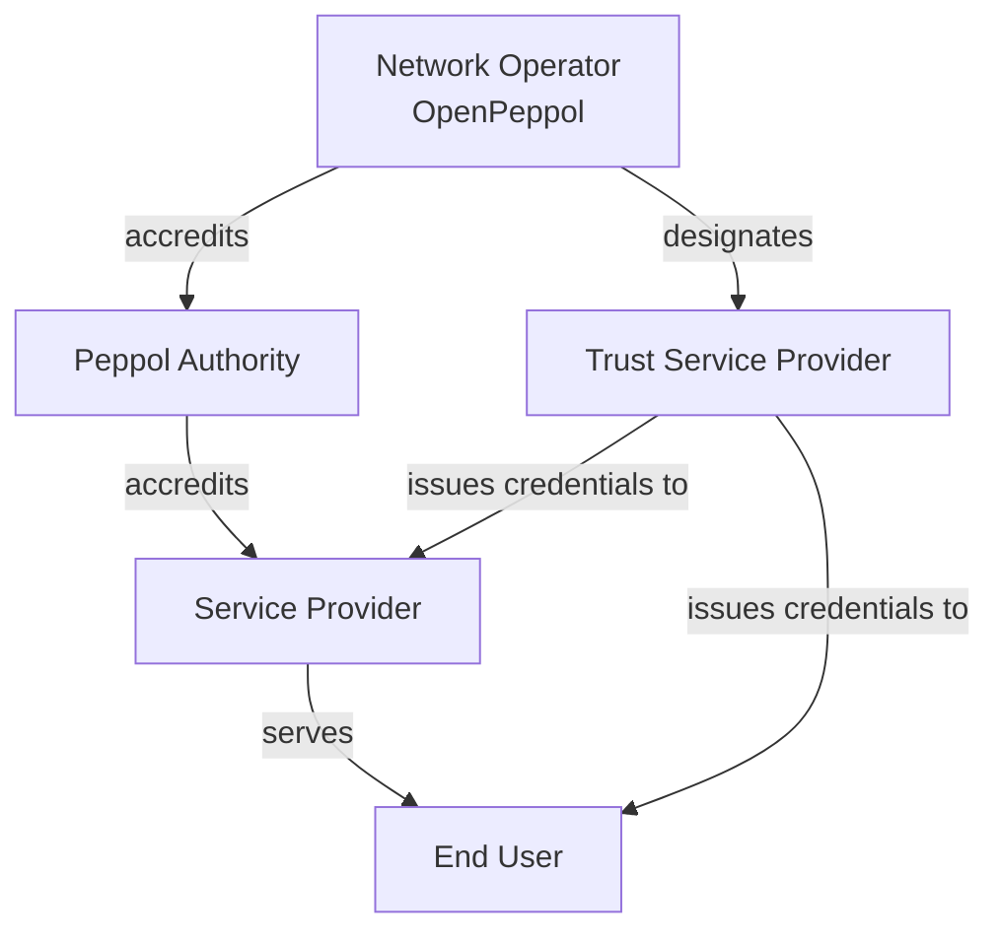

# Participant Taxonomy

{: .draft }
> Draft – categories are proposed and subject to WS3 agreement.

## Participant categories

_The taxonomy distinguishes participants by their role in the network and 
the trust obligations that role implies._

| Category | Description | Current Peppol equivalent |
|---|---|---|
| **Network Operator** | Operates core network infrastructure (SML, PKI) | OpenPeppol |
| **Peppol Authority** | Accredits SPs within a jurisdiction | Peppol Authority |
| **Service Provider** | Provides AP/SMP services to end users | Accredited SP |
| **End User – Legal Entity** | Business or organisation exchanging documents | Corner 1 / Corner 4 |
| **End User – Public Authority** | Government entity with specific regulatory status | Subset of above |
| **Trust Service Provider** | Issues certificates or verifiable credentials | New role |

## Hierarchy

## Notes on boundary cases

_Address participant types that don't map cleanly to the above categories._
